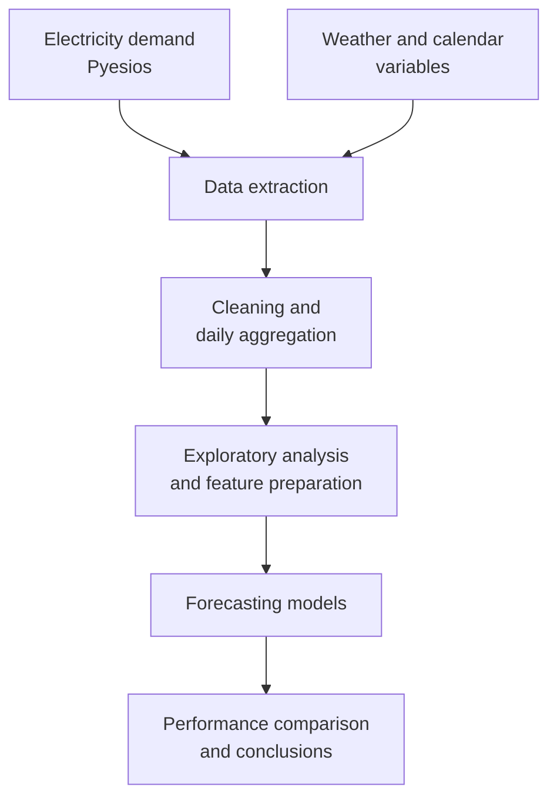

# Electricity Demand Forecasting with Machine Learning

A comparative time-series forecasting project that evaluates statistical, machine-learning, and deep-learning models for predicting daily electricity demand.

The project covers the complete analytical workflow: data acquisition, preprocessing, exploratory analysis, feature preparation, model training, evaluation, and technical documentation.

## Table of Contents

- [Project Overview](#project-overview)
- [Objectives](#objectives)
- [Architecture](#architecture)
- [Data Pipeline](#data-pipeline)
- [Implemented Models](#implemented-models)
- [Project Structure](#project-structure)
- [Technology Stack](#technology-stack)
- [Local Setup](#local-setup)
- [Execution Order](#execution-order)
- [Results and Conclusions](#results-and-conclusions)
- [Limitations](#limitations)
- [Future Improvements](#future-improvements)

## Project Overview

Electricity demand is a critical variable for energy-system planning and operation. Its limited storage capacity and strong dependence on temporal, meteorological, and social factors make accurate forecasting particularly valuable.

This project compares several forecasting approaches using historical electricity-demand data together with exogenous variables such as temperature, humidity, and holidays. The objective is not only to identify the most accurate model, but also to assess the trade-off between predictive performance, computational cost, and implementation complexity.

The analysis is based on daily aggregated data and includes the following model families:

- Traditional time-series modelling with ARIMAX.
- Supervised machine learning with Decision Tree, Random Forest, and XGBoost.
- Deep learning with an LSTM neural network.

## Objectives

The main objectives of the project are:

1. Extract historical electricity-demand and meteorological data.
2. Clean, transform, and combine the different data sources.
3. Explore temporal patterns and relationships between demand and exogenous variables.
4. Train statistical, machine-learning, and deep-learning forecasting models.
5. Compare their accuracy, computational cost, and practical applicability.
6. Identify the variables that contribute most to electricity-demand forecasting.
7. Document the methodology and results in a reproducible project structure.

## Architecture



The repository follows a notebook-based analytical workflow. Raw information is extracted from its original sources, transformed into a common daily-granularity dataset, analysed, and then reused by each forecasting experiment.

## Data Pipeline

### 1. Data Extraction

The first stage retrieves the input variables required by the models:

- Historical electricity demand.
- Temperature.
- Humidity.
- Calendar-related variables such as holidays.

The extraction notebooks generate intermediate CSV files so that the remaining analysis can be executed without repeatedly querying the original sources.

### 2. Preprocessing

The preprocessing stage prepares a unified modelling dataset by:

- Reviewing and cleaning the extracted records.
- Aligning electricity-demand and meteorological observations.
- Aggregating the information at daily level.
- Transforming the variables into a model-ready structure.
- Generating the final processed dataset used by the forecasting notebooks.

### 3. Exploratory Data Analysis

The exploratory notebook studies the behaviour of electricity demand and its relationship with the available explanatory variables. This stage supports feature selection and helps identify seasonality, temporal patterns, anomalies, and potentially noisy variables.

### 4. Modelling and Evaluation

Each modelling notebook trains and evaluates a different forecasting approach. The results are consolidated in `results.xlsx` to support a consistent comparison across model families.

## Implemented Models

| Model | Family | Main purpose |
|---|---|---|
| ARIMAX | Statistical time series | Model temporal behaviour while incorporating exogenous variables. |
| Decision Tree | Machine learning | Provide a simple non-linear baseline with interpretable decision rules. |
| Random Forest | Ensemble machine learning | Improve stability and generalisation by combining multiple decision trees. |
| XGBoost | Gradient boosting | Capture complex non-linear relationships with strong predictive efficiency. |
| LSTM | Deep learning | Learn sequential and long-term temporal dependencies from time-series data. |

The models are assessed using the same processed dataset, enabling a direct comparison of predictive capacity and computational requirements.

## Project Structure

The repository is organized into four main areas covering documentation, data preparation, modelling, and dataset storage.

### `latex/` — Academic Documentation

Contains the complete thesis report and its supporting LaTeX resources.

### `preprocessing/` — Data Preparation

Contains the notebooks and datasets used for data acquisition, transformation, and exploratory analysis.

| File | Purpose |
|---|---|
| `extracción_temperatura_humedad.ipynb` | Retrieves and processes temperature and humidity data. |
| `datos_climáticos_diarios.csv` | Stores the processed daily meteorological data. |
| `extracción_demanda_eléctrica.ipynb` | Retrieves historical electricity-demand data. |
| `datos_demanda_media_diaria.csv` | Stores the calculated daily average electricity demand. |
| `preprocesamiento.ipynb` | Cleans, transforms, and combines the available data sources. |
| `datos_preprocesados.csv` | Final model-ready dataset generated during preprocessing. |
| `EDA.ipynb` | Explores trends, seasonality, correlations, and anomalous values. |

### `models/` — Forecasting Models

Contains the implementation, optimization, and evaluation of the forecasting approaches.

| File | Purpose |
|---|---|
| `ARIMAX.ipynb` | Implements and optimizes the statistical ARIMAX model. |
| `generic_model.ipynb` | Trains and evaluates Decision Tree, Random Forest, and XGBoost models. |
| `LSTM.ipynb` | Implements the LSTM neural network for sequential forecasting. |
| `results.xlsx` | Consolidates the performance metrics obtained by each model. |

### `data/` — Dataset Backup

Preserves backup copies of the raw, intermediate, and processed datasets used throughout the project.

### Directory Responsibilities

| Path | Responsibility |
|---|---|
| `latex/` | Contains the complete academic report and its supporting LaTeX files. |
| `preprocessing/` | Contains data extraction, cleaning, transformation, and exploratory-analysis notebooks. |
| `models/` | Contains the forecasting experiments and the consolidated model comparison. |
| `data/` | Preserves backup copies of raw and processed datasets. |

## Technology Stack

### Programming Language

- Python

### Data Processing and Analysis

- Pandas
- NumPy
- Matplotlib

### Forecasting and Machine Learning

- Scikit-learn
- XGBoost
- Skforecast
- Keras
- ARIMAX-compatible statistical modelling libraries

### Data Acquisition and Outputs

- Pyesios
- CSV
- Microsoft Excel
- Jupyter Notebook

## Local Setup

### Requirements

- Python 3.10 or later.
- `pip` or another compatible Python package manager.
- Jupyter Notebook or JupyterLab.

### 1. Create a Virtual Environment

From the repository root:

```bash
python -m venv .venv
```

Activate it on Linux or macOS:

```bash
source .venv/bin/activate
```

Activate it on Windows PowerShell:

```powershell
.venv\Scripts\Activate.ps1
```

### 2. Install the Main Dependencies

If the repository includes a `requirements.txt` file, install the pinned dependencies with:

```bash
pip install -r requirements.txt
```

Otherwise, the main project dependencies can be installed with:

```bash
pip install pandas numpy matplotlib scikit-learn xgboost skforecast keras tensorflow pyesios statsmodels openpyxl jupyter
```

### 3. Start Jupyter

```bash
jupyter lab
```

Open the notebooks from the Jupyter interface and execute them in the order described below.

## Execution Order

The recommended execution sequence is:

1. `preprocessing/extracción_temperatura_humedad.ipynb`
2. `preprocessing/extracción_demanda_eléctrica.ipynb`
3. `preprocessing/preprocesamiento.ipynb`
4. `preprocessing/EDA.ipynb`
5. `models/ARIMAX.ipynb`
6. `models/generic_model.ipynb`
7. `models/LSTM.ipynb`
8. Review the consolidated comparison in `models/results.xlsx`.

If the processed CSV files are already available and no source refresh is required, the extraction notebooks can be skipped. Before running a model independently, verify that `datos_preprocesados.csv` is up to date.

## Results and Conclusions

The comparison identified **XGBoost** as the most effective model in terms of the balance between forecast accuracy and computational cost. Its ability to model non-linear relationships made it especially suitable for the available daily electricity-demand dataset.

The **LSTM** model also showed potential for time-series forecasting. However, its performance was constrained by longer processing times and by the granularity and volume of the available data. A larger dataset with more frequent observations could provide a stronger basis for deep-learning experiments.

The analysis also confirmed the relevance of exogenous information. Variables such as **temperature** and **holidays** contributed useful predictive context, whereas **humidity** introduced additional noise in some experiments.

Overall, the project demonstrates that machine-learning techniques can improve electricity-demand forecasting while remaining computationally practical. It also highlights that model selection should consider not only predictive accuracy, but also data availability, processing cost, maintainability, and the intended operational use.

## Limitations

- The analysis uses daily aggregated data, which reduces the amount of temporal detail available to the models.
- Deep-learning performance is limited by the volume and granularity of the training data.
- The usefulness of some meteorological variables varies across models.
- The current work focuses on offline experimentation rather than real-time inference.
- Forecast quality depends on the coverage and consistency of the external data sources.

## Future Improvements

- Use hourly or sub-hourly electricity-demand observations.
- Incorporate additional meteorological and calendar variables.
- Apply time-series cross-validation consistently across all model families.
- Expand hyperparameter optimisation for XGBoost, Random Forest, ARIMAX, and LSTM.
- Add experiment tracking and automated metric reporting.
- Package preprocessing and training logic into reusable Python modules.
- Add automated data-quality checks and reproducible environment configuration.
- Develop a scheduled inference pipeline and expose forecasts through an API or dashboard.

## Documentation

The complete methodology, theoretical background, experimental design, and conclusions are available in the report stored under the `latex/` directory.

## Reproducibility Notes

To obtain consistent comparisons:

- Preserve the chronological order of the observations when creating train and test sets.
- Avoid using future information during feature engineering.
- Apply the same evaluation period to every model.
- Set random seeds for stochastic algorithms when supported.
- Record package versions and model hyperparameters together with the final results.

---

This repository is intended as an analytical and academic project for comparing forecasting techniques applied to electricity demand.

